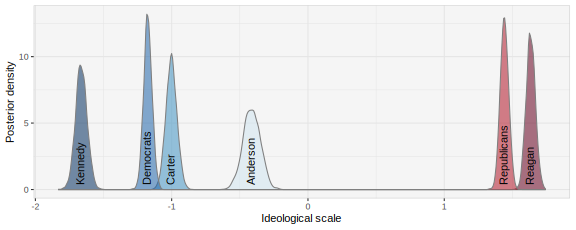
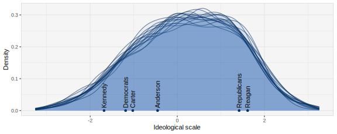
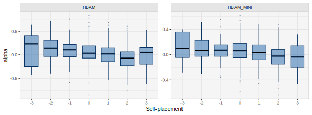
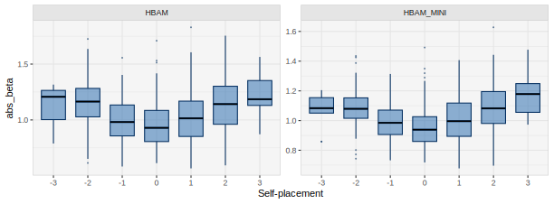
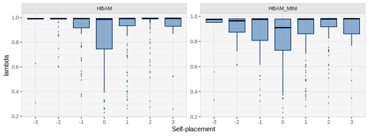
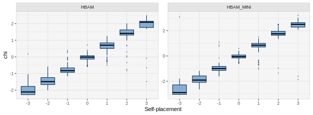
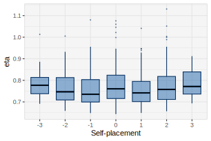
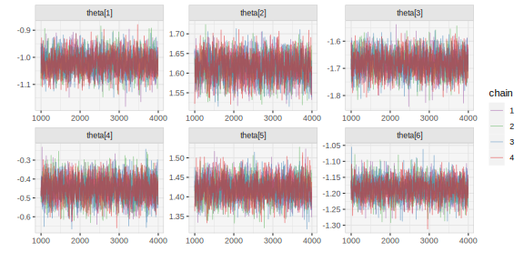

# Hierarchical Bayesian Aldrich-McKelvey Scaling in R via Stan

The goal of the **hbamr** package is to enable users to efficiently
perform Hierarchical Bayesian Aldrich-McKelvey (HBAM) scaling in R.
Aldrich-McKelvey (AM) scaling is a method for estimating the ideological
positions of survey respondents and political actors on a common scale
using ideological survey data (Aldrich and McKelvey 1977). The
hierarchical versions of the AM model included in this package
outperform other versions both in terms of yielding meaningful posterior
distributions for all respondent positions and in terms of recovering
true respondent positions in simulations. The original version of the
default model is described in an [open access
article](https://doi.org/10.1017/pan.2023.18) (Bølstad 2024).

The package mainly fits models via the NUTS algorithm in **rstan** – a
Markov chain Monte Carlo (MCMC) algorithm. However, it also offers a
simplified model that can be fit using optimization to analyze large
data sets quickly.

This vignette provides an overview of how to use the key functions in
the **hbamr** package. The vignette walks through an applied example,
showing how to prepare data, fit models, extract estimates, plot key
results, and perform cross-validation.

## Example Data

For illustration, we will use data from the 1980 American National
Election Study (ANES). This is the same data set that serves to
illustrate the original AM model in the **basicspace** package. The data
set is included in the **hbamr** package and can be loaded by running
`data(LC1980)`.

The data set contains respondents’ placements of themselves and six
stimuli on 7-point Liberal-Conservative scales. The stimuli in question
are: The Democratic and Republican parties, Democratic presidential
candidate Jimmy Carter, Republican candidate Ronald Reagan, independent
candidate (and former Republican) John B. Anderson, and Ted Kennedy (who
challenged the incumbent Carter, but failed to win the Democratic
nomination).

We load the data and re-code missing values as follows:

``` r
library("hbamr")
data(LC1980)
LC1980[LC1980 == 0 | LC1980 == 8 | LC1980 == 9] <- NA 
self <- LC1980[, 1]
stimuli <- LC1980[, -1]
```

``` r
head(stimuli) 
```

    ##    Carter Reagan Kennedy Anderson Republicans Democrats
    ## 1       2      6       1        7           5         5
    ## 8       4      6       4        7           6         4
    ## 9       3      6       3        3           6         2
    ## 10      6      4       3        3           5         4
    ## 11      7      2       5        5           7         5
    ## 13      6      6       2        5           7         4

## Preparing the Data

The function
[`prep_data()`](https://jbolstad.github.io/hbamr/reference/prep_data.md)
serves to prepare the data. This function can be run ahead of fitting
the models, or it can be run implicitly as part of a single function
call to fit the models (as shown below). The function takes a vector of
$N$ ideological self-placements and an $N \times J$ matrix of stimulus
placements. The self-placement vector is required to estimate respondent
positions, but can be dropped if such data are not available or if the
respondent positions are not of interest.

[`prep_data()`](https://jbolstad.github.io/hbamr/reference/prep_data.md)
applies a set of inclusion criteria, performs any necessary data
transformation, and returns a list of data suited for sampling in
**rstan**. The stimuli data are stored in a vector as a long-form sparse
matrix. If the stimuli data include column-names, these will be
preserved for later use.

Any missing data must be set to `NA` before use. The
[`prep_data()`](https://jbolstad.github.io/hbamr/reference/prep_data.md)
function allows the user to decide how many missing values should be
permitted per respondent by specifying the argument `allow_miss`. (The
default is `allow_miss = 2`. Alternatively, the argument `req_valid`
specifies how many valid observations to require per respondent. The
default is `req_valid = J - allow_miss`, but, if specified, `req_valid`
takes precedence.) Similarly, the user may specify how many unique
positions on the ideological scale each respondent is required to have
used when placing the stimuli in order to be included in the analysis.
The default is `req_unique = 2`, which means that respondents who place
all stimuli in exactly the same place will not be included.

The data provided to
[`prep_data()`](https://jbolstad.github.io/hbamr/reference/prep_data.md)
can be centered, but they do not have to be: The function will detect
un-centered data and attempt to center these automatically, assuming
that the highest and lowest observed values in the data mark the
extremes of the scale.

To use the
[`prep_data()`](https://jbolstad.github.io/hbamr/reference/prep_data.md)
function on the example data using the default settings, we would run:

``` r
dat <- prep_data(self, stimuli)
```

Users who want to keep other covariates for subsequent analysis may find
it useful to run
[`prep_data()`](https://jbolstad.github.io/hbamr/reference/prep_data.md)
separately from the call to fit the models. The list returned by this
function includes the logical vector `keep`, which identifies the rows
in the original data that have been kept. If we had a data set `x`
containing covariates, and used
[`prep_data()`](https://jbolstad.github.io/hbamr/reference/prep_data.md)
to produce the list `dat`, then we could use `x[dat$keep, ]` to get a
subset of `x` corresponding to the data used in the analysis. (The order
of the individuals/rows in the data remains unchanged by the functions
in this package.)

## Models

This package provides several alternative models that can be selected
using the names below. Users who are unsure which model to use are
advised to use the default HBAM model. If speed or sampling diagnostics
are an issue, HBAM_MINI may provide a useful alternative. (See also the
section on cross-validation for further discussion on the issue of model
selection.)

**HBAM** is the default model, which allows for scale flipping and
employs hierarchical priors on the shift and stretch parameters. It also
models heteroskedastic errors that vary by both individual and stimuli.
Compared to the model in Bølstad (2024), this version has been slightly
revised to provide faster sampling. A key difference from the original
model is that the respondent positions are not treated as parameters,
but rather calculated as a function of self-placements, individual-level
parameters, and simulated errors. This makes the model considerably
faster, while yielding very similar results. The model simulates errors
in the self-placements with the same magnitude as each respondent’s
smallest stimulus-placement errors. All models in the package use this
approach.

**HBAM_MULTI** is a version that models differences between groups
defined by the user. It requires a vector identifying the groups to be
supplied as the argument `group_id`. The model gives each group separate
hyperparameters for the locations of the prior distributions for the
shift and stretch parameters. Rather than shrinking the estimates toward
the mode for the whole data set, this model shrinks the estimates toward
the mode for the group. The vectors of hyperparameters are called
`mu_alpha` and `mu_beta` and are constructed to have means of 0. The
scales of the priors on these hyperparameters can be set by the user via
the arguments `sigma_mu_alpha` and `sigma_mu_beta`. The default values
are B / 10 and .2, respectively. (Here, B measures the length of the
survey scale as the number of possible placements on one side of the
center.) One potential use for this model is to supply self-placements
as `group_id`, and thus give each self-placement group its own prior
distribution for the shift and stretch parameters.

**HBAM_NF** (formerly HBAM_0) is a version of the HBAM model that does
not allow for scale flipping. This may be useful if there are truly zero
cases of scale flipping in the data. Such scenarios can be created
artificially, but may also arise in real data. For example, expert
surveys appear unlikely to contain many instances of scale flipping. For
data that contain zero cases of flipping, models that allow for flipping
contain superfluous parameters that lead to inefficient sampling. Models
that do not allow for flipping will sample faster and typically yield
slightly more accurate estimates. Such models are therefore usually
preferable when no flipping is present.

**HBAM_MULTI_NF** is a version of the HBAM_MULTI model that does not
allow for scale flipping.

**HBAM_MINI** is a version of the HBAM model that assumes the prediction
errors in the stimuli placements to be homoskedastic. This model tends
to sample faster than the standard HBAM model while yielding very
similar point estimates. For large data sets, this model may provide a
reasonable compromise between model complexity and estimation speed.

**FBAM** is a version of the HBAM model with fixed hyperparameters to
allow fitting via optimization rather than MCMC – which can be useful
for large data sets. This model allows the user to specify the scales of
the priors for the shift and (logged) stretch parameters via the
arguments `sigma_alpha` and `sigma_beta`. The default values are B / 5
and .3, respectively. These defaults are intended to be realistic and
moderately informative. Users who want to control the degree of
shrinkage of the individual-level parameters may find it useful to fit
this model – or other FBAM models – via either MCMC or optimization.

**FBAM_MULTI** is a version of the FBAM model that shares the
group-modeling features of the HBAM_MULTI model. It allows the user to
set the scales of the priors for the shift and stretch parameters via
the arguments `sigma_alpha` and `sigma_beta`, and set the scales of the
priors on `mu_alpha` and `mu_beta` via the arguments `sigma_mu_alpha`
and `sigma_mu_beta`.

**FBAM_MULTI_NF** is a version of the FBAM_MULTI model that does not
allow for scale flipping.

**HBAM_R_MINI** is a version of the HBAM_MINI model that incorporates
the rationalization component of the ISR model in Bølstad (2020). This
model requires additional data to be supplied as the argument `pref`: An
N × J matrix of stimuli ratings from the respondents. The
rationalization part of the model is simplified relative to the original
ISR model: The direction in which respondents move disfavored stimuli is
estimated as a common expectation for each possible self-placement on
the scale.

**BAM** is an unpooled model with wide uniform priors on the shift and
stretch parameters. It is similar to the JAGS version introduced by Hare
et al. (2015), although the version included here has been adjusted to
yield stretch parameters with an average of approximately one (and thus
produce a scale similar to those of the other models in the package).
Like the other models, this version of the BAM model also simulates
errors in the self-placements to yield a realistic level of uncertainty.
While this model is simple and fast, it tends to overfit the data and
produce invalid posterior distributions for some respondent positions
(Bølstad 2024). However, it could potentially be useful as a baseline
for model comparisons in situations where respondent positions are not
of interest.

**HBAM_2** has been replaced by the more general HBAM_MULTI model.

These models can also be used in situations where self-placements are
not available and the only goal is to estimate stimulus positions or
respondents’ shift and stretch parameters. While the latent respondent
positions will not be estimated, all other parameters are unaffected if
the argument `self` is dropped when calling
[`prep_data()`](https://jbolstad.github.io/hbamr/reference/prep_data.md)
or [`hbam()`](https://jbolstad.github.io/hbamr/reference/hbam.md).

### Summary of Model Features

[TABLE]

Recommended models for fitting via MCMC

[TABLE]

Non-hierarchical and special purpose models (“\*” marks optional
features)

## Fitting

The [`hbam()`](https://jbolstad.github.io/hbamr/reference/hbam.md)
function can be used to fit all models in this package and obtain a
`stanfit` object. The default model is HBAM, while other models can be
specified via the argument `model`.

Unless the user supplies pre-prepared data via the `data` argument,
[`hbam()`](https://jbolstad.github.io/hbamr/reference/hbam.md) will
implicitly run
[`prep_data()`](https://jbolstad.github.io/hbamr/reference/prep_data.md).
It therefore takes the same arguments as the
[`prep_data()`](https://jbolstad.github.io/hbamr/reference/prep_data.md)
function (i.e. `self`, `stimuli`, `group_id`, `allow_miss`, `req_valid`,
and `req_unique`).

To fit the HBAM model using the default settings, we would run:

``` r
fit_hbam <- hbam(self, stimuli)
```

To fit the HBAM_MINI model while requiring complete data for all
respondents, we would run:

``` r
fit_hbam_mini <- hbam(self, stimuli, model = "HBAM_MINI", allow_miss = 0)
```

If we wanted to run the
[`prep_data()`](https://jbolstad.github.io/hbamr/reference/prep_data.md)
function separately before fitting the model, we would supply output
from
[`prep_data()`](https://jbolstad.github.io/hbamr/reference/prep_data.md)
as the argument `data`:

``` r
dat <- prep_data(self, stimuli, allow_miss = 0) 
fit_hbam <- hbam(data = dat)
```

To fit the HBAM_MULTI or FBAM_MULTI model, we would need to supply a
vector identifying the groups of interest. One option would be to supply
respondents’ self-placements as `group_id` and thus give each
self-placement group their own prior distributions for the shift and
stretch parameters. If we decided to fit the FBAM_MULTI model, we could
also specify our own scales for the priors on key parameters:

``` r
fit_fbam_multi <- hbam(self, stimuli, model = "FBAM_MULTI", group_id = self, 
                       sigma_alpha = .8, sigma_mu_alpha = .7, 
                       sigma_beta = .4, sigma_mu_beta = .25)
```

[`hbam()`](https://jbolstad.github.io/hbamr/reference/hbam.md) uses
[`rstan::sampling()`](https://mc-stan.org/rstan/reference/stanmodel-method-sampling.html),
and any additional arguments to
[`hbam()`](https://jbolstad.github.io/hbamr/reference/hbam.md) will be
passed on to the sampling function. By default,
[`hbam()`](https://jbolstad.github.io/hbamr/reference/hbam.md) will run
4 chains and detect the number of available CPU cores. If possible,
[`hbam()`](https://jbolstad.github.io/hbamr/reference/hbam.md) will use
as many cores as there are chains. The other sampling defaults are:
`warmup = 1000` and `iter = 2000`. These settings can all be overridden
in the [`hbam()`](https://jbolstad.github.io/hbamr/reference/hbam.md)
call.

### Fitting via Optimization

For very large data sets, optimization can be a useful and much faster
alternative to MCMC. However, the optimization feature provided in this
package only provides maximum a posteriori (MAP) point estimates.

The [`fbam()`](https://jbolstad.github.io/hbamr/reference/fbam.md)
function fits FBAM models using
[`rstan::optimizing()`](https://mc-stan.org/rstan/reference/stanmodel-method-optimizing.html).
The [`fbam()`](https://jbolstad.github.io/hbamr/reference/fbam.md)
function works just like the
[`hbam()`](https://jbolstad.github.io/hbamr/reference/hbam.md) function,
except the arguments for
[`rstan::sampling()`](https://mc-stan.org/rstan/reference/stanmodel-method-sampling.html)
do not apply. To fit the FBAM model using default settings, we would
run:

``` r
fit_fbam <- fbam(self, stimuli)
```

### Execution Times

Models of the kind included in the **hbamr** package face an inevitable
trade-off between nuance (i.e. model complexity) and execution times.
For small data sets (like ANES 1980), all models provide reasonable
running times, but for large data sets, more complex models tend to get
slow. In these cases, the HBAM_MINI model may be a useful alternative.
For very large data sets, fitting the FBAM model via optimization may be
the best alternative.

[TABLE]

Execution times on an Apple M4 Pro CPU

## Plotting

The **hbamr** package contains several functions for creating
presentable plots of the results. The package uses **ggplot2**, which
means ggplot themes can be added to the plots.

### Stimuli Positions

The function
[`plot_stimuli()`](https://jbolstad.github.io/hbamr/reference/plot_stimuli.md)
plots the marginal posterior distributions of all stimuli in the data.
By default, it will fill the distributions with shades from blue to red
depending on the position on the scale. The argument `rev_color = TRUE`
will reverse the order of the colors.

``` r
plot_stimuli(fit_hbam)
```



In this example, we see that John B. Anderson – the former Republican
who ran as an independent candidate – gets a wider posterior
distribution, suggesting that voters were more uncertain about where to
place him relative to the others.

### Respondent Positions

The function
[`plot_respondents()`](https://jbolstad.github.io/hbamr/reference/plot_respondents.md)
plots the distribution of estimated respondent positions. It illustrates
the uncertainty of the estimates by calculating the population density
for each of a set of posterior draws. The default is to use 15 draws for
each respondent, but this can be altered by specifying the argument
`n_draws`. The
[`plot_respondents()`](https://jbolstad.github.io/hbamr/reference/plot_respondents.md)
function also plots the estimated stimulus positions by default, but
this behavior can be turned off by adding the argument
`inc_stimuli = FALSE`.

``` r
plot_respondents(fit_hbam, n_draws = 10)
```



Users who want to customize the plots further can obtain the underlying
data by using the function
[`get_plot_data()`](https://jbolstad.github.io/hbamr/reference/get_plot_data.md).
This function accepts the same `n_draws`-argument as
[`plot_respondents()`](https://jbolstad.github.io/hbamr/reference/plot_respondents.md).
The output is a list of three tibbles: The first element contains the
posterior mean stimulus positions, as well as the $x$- and $y$-values of
the posterior modes (which can be useful for labeling the
distributions). The second element contains the posterior draws for the
stimulus positions (which can be used to calculate marginal posterior
densities). The third element contains the selected number of posterior
draws for each respondent (which form the key ingredient for the
[`plot_respondents()`](https://jbolstad.github.io/hbamr/reference/plot_respondents.md)
function).

### Individual Parameters over Self-Placements

The function
[`plot_over_self()`](https://jbolstad.github.io/hbamr/reference/plot_over_self.md)
plots the distributions of key parameter estimates over the respondents’
self-placements. The function will accept either a single `stanfit`
object produced by
[`hbam()`](https://jbolstad.github.io/hbamr/reference/hbam.md), results
from [`fbam()`](https://jbolstad.github.io/hbamr/reference/fbam.md), or
a list of such objects.

The user specifies which parameter to show via the argument `par`. This
can be either of the following: `"alpha"`, `"beta"`, `"abs_beta"`,
`"lambda"`, or `"chi"`, where `"abs_beta"` calls for the absolute value
of beta to be used. By default, the function uses posterior median
estimates, but this can be changed by specifying `estimate = "mean"`.

#### Shifting

To compare the distributions of estimated shift parameters from the HBAM
and HBAM_MINI models, we would run:

``` r
plot_over_self(list(fit_hbam, fit_hbam_mini), "alpha")
```



#### Stretching

For models that allow for scale flipping, the draws for $\beta$ combine
the separate parameters for each flipping-state. The absolute value of
$\beta$ may therefore be better suited for examining the extent to which
each individual stretches the ideological space. To inspect the
distribution of these values across self-placements, we would run:

``` r
plot_over_self(list(fit_hbam, fit_hbam_mini), "abs_beta")
```



The pattern above, where respondents with more extreme self-placements
have more extreme $\beta$ parameters, is exactly the kind of
differential item functioning that the models in this package are
intended to correct for: These respondents tend to place both stimuli
and themselves further out on the scale than others do, thus appearing
more extreme in comparison.

#### Flipping

To see whether the $\beta$ parameters are likely to be positive or
negative, we can look at the expectations of the flipping parameters,
$\lambda$. These parameters represent each respondent’s probability of
*not* flipping the scale:

``` r
plot_over_self(list(fit_hbam, fit_hbam_mini), "lambda")
```



In this example, flipping is uncommon, but respondents who place
themselves in the middle have a somewhat higher flipping-probability.
This may suggest that some of these respondents are less informed about
politics and provide less accurate answers.

#### Respondent Positions

It may also be useful to inspect the distribution of the scaled
respondent positions over the self-placements. This illustrates the
extent to which the model has transformed the original data. In this
example, the impact of the models is generally modest, although a few
respondents have been detected as having flipped the scale, and thus
have had their self-placement flipped back.

``` r
plot_over_self(list(fit_hbam, fit_hbam_mini), "chi")
```



#### Additional Parameters

Other individual-level parameters like `"eta"` can also be plotted if
these have been passed to
[`hbam()`](https://jbolstad.github.io/hbamr/reference/hbam.md) via the
argument `extra_pars` when fitting the model. Parameters like $\eta$ are
not stored in the
[`hbam()`](https://jbolstad.github.io/hbamr/reference/hbam.md) results
by default, as this would increase the post-processing time as well as
the size of the model fits. (Note also that homoskedastic models have no
`"eta"` parameters and “NF”-type models have no `"lambda"` or `"kappa"`
parameters.)

The estimated $\eta$ parameters yield information about the accuracy of
respondents’ answers. When the argument `par = "eta"` is specified, the
plotting function will display $\sqrt{\eta_{i}}/J$, which equals the
average error for each individual (the mean of $\sigma_{ij}$ for each
$i$ across $j$). The point estimates will still be calculated using the
posterior median, unless the argument `estimate = "mean"` is added.

``` r
fit_hbam <- hbam(data = dat, extra_pars = "eta")
plot_over_self(fit_hbam, "eta")
```



## Posterior Summaries

The package also contains a wrapper for `rstan::summary()` called
[`get_est()`](https://jbolstad.github.io/hbamr/reference/get_est.md).
This function takes the arguments `object` – a `stanfit` object produced
by [`hbam()`](https://jbolstad.github.io/hbamr/reference/hbam.md) or a
list produced by
[`fbam()`](https://jbolstad.github.io/hbamr/reference/fbam.md) – and
`par` – the name of the parameter(s) to be summarized. The function
returns a tibble, which by default contains the posterior mean, the 95%
credible interval, the posterior median, the estimated number of
effective draws, and the split R-hat. One can obtain other posterior
quantiles by using the argument `probs`. To get a 50% credible interval
(and no median), one would add the argument `probs = c(0.25, 0.75)`. To
include the Monte Carlo standard error and the posterior standard
deviation, use the argument `simplify = FALSE`. (When applied to outputs
from [`fbam()`](https://jbolstad.github.io/hbamr/reference/fbam.md),
[`get_est()`](https://jbolstad.github.io/hbamr/reference/get_est.md)
only returns point estimates.)

The posterior draws for the stimulus positions can be summarized as
follows:

``` r
get_est(fit_hbam, "theta")
```

    ## # A tibble: 6 × 6
    ##     mean `2.5%`  `50%` `97.5%` n_eff  Rhat
    ##    <dbl>  <dbl>  <dbl>   <dbl> <dbl> <dbl>
    ## 1 -1.00  -1.08  -1.00   -0.923 1581. 1.00 
    ## 2  1.64   1.57   1.64    1.70  1720. 1.00 
    ## 3 -1.66  -1.74  -1.66   -1.58  1884. 1.00 
    ## 4 -0.411 -0.533 -0.411  -0.291 3547. 1.000
    ## 5  1.44   1.39   1.44    1.50  1820. 1.00 
    ## 6 -1.18  -1.24  -1.18   -1.11  1804. 1.00

To get summaries of the respondent positions, we would specify
`par = "chi"`. If we want the results to match the rows in the original
data set by reporting rows of NAs for respondents who were not included
in the analysis, we would add the argument `format_orig = TRUE`:

``` r
get_est(fit_hbam, "chi", format_orig = TRUE)
```

    ## # A tibble: 888 × 6
    ##       mean `2.5%`   `50%` `97.5%` n_eff   Rhat
    ##      <dbl>  <dbl>   <dbl>   <dbl> <dbl>  <dbl>
    ##  1  1.46   -2.84   1.83     3.89  3641.  1.000
    ##  2  1.59   -1.72   1.65     3.44  3511.  1.00 
    ##  3  1.58   -1.12   1.63     2.78  4198.  0.999
    ##  4  0.0147 -1.99   0.0451   1.98  3946.  1.00 
    ##  5 -0.470  -2.14  -0.558    1.27  4316.  1.00 
    ##  6  1.83   -3.51   2.19     4.22  3633.  1.000
    ##  7 -0.188  -1.18  -0.184    0.712 4305.  1.000
    ##  8  1.04   -1.72   1.12     2.30  3484.  1.00 
    ##  9 NA      NA     NA       NA       NA  NA    
    ## 10  0.694  -0.964  0.736    2.00  3818.  1.00 
    ## # ℹ 878 more rows

## Cross-Validation

A useful way to compare alternative models is to estimate their
out-of-sample prediction accuracy. More specifically, we can estimate
their expected log pointwise predictive density for a new data set
(ELPD).

The **rstan** and **loo** packages contain functions for estimating
ELPDs by performing approximate leave-one-out (LOO) cross-validation
using Pareto smoothed importance sampling (PSIS). These functions can be
used on model fits from
[`hbam()`](https://jbolstad.github.io/hbamr/reference/hbam.md) if the
argument `extra_pars = "log_lik"` is specified when fitting the model:

``` r
fit_hbam <- hbam(data = dat, extra_pars = "log_lik")
loo_hbam <- loo::loo(fit_hbam)
```

However, PSIS-LOO only works when all Pareto *k* values are sufficiently
low, or when the number of high values is so low that moment matching
can be used on the problematic cases. This is not always the case for
the models in this package.

The **hbamr** package therefore allows users to perform *K*-fold
cross-validation. The function
[`hbam_cv()`](https://jbolstad.github.io/hbamr/reference/hbam_cv.md) is
similar to
[`hbam()`](https://jbolstad.github.io/hbamr/reference/hbam.md) and takes
the same arguments, but will perform a *K*-fold cross-validation for the
chosen model. In contrast to
[`hbam()`](https://jbolstad.github.io/hbamr/reference/hbam.md), the
default for
[`hbam_cv()`](https://jbolstad.github.io/hbamr/reference/hbam_cv.md) is
to not allow respondents to have any missing values (`allow_miss = 0`).
The reason is that the cross-validation essentially creates missing
values by excluding some data from each run.

A key choice when performing cross-validation is to set *K* (the number
of folds to use), and the default in this package is 10. To preserve
memory, the function extracts the summaries of the log-likelihoods for
the held-out data and drops the stanfit objects once this is done. The
memory requirements of the function are therefore similar to running a
single analysis with one chain per core. The function that splits the
data into *K* folds uses a default seed to produce the same folds each
time, unless a different seed is specified.

The [`hbam_cv()`](https://jbolstad.github.io/hbamr/reference/hbam_cv.md)
function is written to allow parallel computation via the `future`
package to minimize execution time. The `future` package offers several
computational strategies, of which “multisession” works on all operating
systems. In most settings, it is advisable to use all physical CPU cores
when performing cross-validation. To set up parallel computation using 4
cores via the `future` package, we could run:

``` r
library(future)
plan(multisession, workers = 4)
```

To perform 10-fold cross-validation for a selection of models, we could
run:

``` r
kfold_bam <- hbam_cv(self, stimuli, model = "BAM")
kfold_hbam <- hbam_cv(self, stimuli, model = "HBAM")
kfold_hbam_nf <- hbam_cv(self, stimuli, model = "HBAM_NF")
kfold_hbam_multi <- hbam_cv(self, stimuli, group_id = self, 
                            model = "HBAM_MULTI")
```

The [`hbam_cv()`](https://jbolstad.github.io/hbamr/reference/hbam_cv.md)
function returns an object of classes `kfold` and `loo`, which can be
further processed using the `loo` package. To compare the estimated
ELPDs, we could run:

``` r
print(loo::loo_compare(list(BAM = kfold_bam, 
                            HBAM = kfold_hbam, 
                            HBAM_NF = kfold_hbam_nf, 
                            HBAM_MULTI = kfold_hbam_multi)), simplify = FALSE)
```

    ##            elpd_diff se_diff elpd_kfold se_elpd_kfold
    ## HBAM_MULTI     0.0       0.0 -5503.3       49.2      
    ## HBAM          -8.6       8.8 -5511.9       49.3      
    ## HBAM_NF     -255.5      27.7 -5758.7       51.3      
    ## BAM         -331.5      38.4 -5834.8       58.7

We see that the unpooled BAM model is worse at predicting out-of-sample
data than the other models, suggesting it overfits the data. The HBAM_NF
model – which does not allow for scale flipping – also performs worse,
suggesting it is too restrictive and underfits. The HBAM and HBAM_MULTI
models outperform the other two models in this case. The HBAM_MULTI
model – with self-placements as `group_id` – may have a slight edge, but
the default HBAM model performs about equally well.

We could also perform cross-validation for a model that does not account
for heteroskedastic errors:

``` r
kfold_hbam_mini <- hbam_cv(self, stimuli, model = "HBAM_MINI")
```

``` r
kfold_hbam_mini
```

    ## 
    ## 
    ##            Estimate   SE
    ## elpd_kfold  -5882.0 48.6

The ELPD for the HBAM_MINI model is notably lower than that of the HBAM
model, which suggests there is a considerable degree of
heteroskedasticity in the data. While modeling the heteroskedasticity
increases prediction accuracy, it should be noted that this does not
necessarily translate into much more accurate estimates of key model
outputs. As shown in the section on plotting, the results for the HBAM
and HBAM_MINI models are very similar. In fact, their estimated
respondent positions correlate at .97 and .99, depending on whether we
use the posterior means or medians. Their estimated stimulus positions
also correlate at .99, but this masks the fact that the HBAM_MINI model
places the less well-known candidate John B. Anderson further to the
left than the HBAM model does. There are some subtle differences that
users should be aware of, even if these models tend to produce very
similar results.

## Diagnostics

The
[`rstan::sampling()`](https://mc-stan.org/rstan/reference/stanmodel-method-sampling.html)
function that
[`hbam()`](https://jbolstad.github.io/hbamr/reference/hbam.md) uses
automatically performs a number of key diagnostic checks after sampling
and issues warnings when a potential issue is detected. The authors of
**rstan** emphasize diagnostics and careful model development, and users
of **rstan** will more frequently encounter warnings than users of
**rjags**. One warning users of this package may encounter is that the
Bulk or Tail Effective Sample Size (ESS) is too low (see
<https://mc-stan.org/misc/warnings.html>). The most straightforward
solution to this issue is to increase the number of posterior draws,
using the `iter` argument. However, this increases the computational
load, and users should consider carefully what level of accuracy they
need.

Because the
[`hbam()`](https://jbolstad.github.io/hbamr/reference/hbam.md) function
returns a `stanfit` object, the model fit can be examined using the full
range of diagnostic tools from the **rstan** package. Users should
consult the **rstan** documentation for details on the various
diagnostic tests and plots that are available. One example of the
available tools is `traceplot()`:

``` r
rstan::traceplot(fit_hbam, pars = "theta")
```



### Limits to Exact Replication

The functions in this package accept a seed argument for all operations
that involve a random number generator. Supplying a seed is sufficient
to get the exact same results in repeated runs on the same system, but
it does not ensure exact replication across systems or software
versions. The [Stan Reference
Manual](https://mc-stan.org/docs/reference-manual/reproducibility.html)
explains why:

> Floating point operations on modern computers are notoriously
> difficult to replicate because the fundamental arithmetic operations,
> right down to the IEEE 754 encoding level, are not fully specified.
> The primary problem is that the precision of operations varies across
> different hardware platforms and software implementations.
>
> Stan is designed to allow full reproducibility. However, this is only
> possible up to the external constraints imposed by floating point
> arithmetic.

In short, running the functions in this package on different systems
will likely yield slightly different results. It should be noted,
however, that the differences across systems will be minimal and
substantively negligible as long as the user obtains a sufficient number
of posterior draws.

## References

Aldrich, John H, and Richard D McKelvey. 1977. “A Method of Scaling with
Applications to the 1968 and 1972 Presidential Elections.” *American
Political Science Review* 71(1): 111–130.

Bølstad, Jørgen. 2020. “Capturing Rationalization Bias and Differential
Item Functioning: A Unified Bayesian Scaling Approach.” *Political
Analysis* 28(3): 340–355.

Bølstad, Jørgen. 2024. “Hierarchical Bayesian Aldrich-McKelvey Scaling.”
*Political Analysis* 32(1): 50–64.
<https://doi.org/10.1017/pan.2023.18>.

Hare, Christopher et al. 2015. “Using Bayesian Aldrich-McKelvey Scaling
to Study Citizens’ Ideological Preferences and Perceptions.” *American
Journal of Political Science* 59(3): 759–774.
