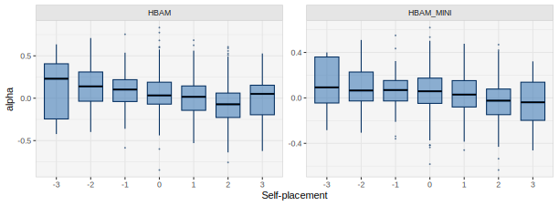

```{r, include = FALSE}
knitr::opts_chunk$set(collapse = TRUE)

load("data.rda")
library("dplyr")
```

```{=html}
<!-- avoid border around images -->
<style> img { border: 0; } </style>
```
The goal of the **hbamr** package is to enable users to efficiently perform Hierarchical Bayesian Aldrich-McKelvey (HBAM) scaling in R. Aldrich-McKelvey (AM) scaling is a method for estimating the ideological positions of survey respondents and political actors on a common scale using ideological survey data [@aldrich:1977]. The hierarchical versions of the AM model included in this package outperform other versions both in terms of yielding meaningful posterior distributions for respondent positions and in terms of recovering true respondent positions in simulations [@boelstad:2023]. The package uses Hamiltonian Monte Carlo via **rstan** to fit these models.

This vignette provides an overview of how to use the key functions in the **hbamr** package. The vignette walks through an applied example, showing how to prepare data, fit models, extract estimates, plot key results, and perform cross-validation.

## Example Data

For illustration, we will use data from the 1980 American National Election Study (ANES). This is the same dataset that serves to illustrate the original AM model in the **basicspace** package. The dataset is included in the **hbamr** package and can be loaded by running `data(LC1980)`.

The dataset contains respondents' placements of themselves and six stimuli on 7-point Liberal-Conservative scales. The stimuli in question are: The Democratic and Republican parties, Democratic presidential candidate Jimmy Carter, Republican candidate Ronald Reagan, independent candidate (and former Republican) John B. Anderson, and Ted Kennedy (who challenged the incumbent Carter, but failed to win the Democratic nomination).

We load the data and re-code missing values as follows:

```{r load_data, echo = TRUE, eval = FALSE, include = TRUE}
library("hbamr")
data(LC1980)
LC1980[LC1980 == 0 | LC1980 == 8 | LC1980 == 9] <- NA 
self <- LC1980[, 1]
stimuli <- LC1980[, -1]
```

```{r show_data, eval = FALSE}
head(stimuli) 
```

```{r, echo = FALSE}
head_stimuli 
```

## Preparing the Data

The function `prep_data()` serves to prepare the data. This function can be run ahead of fitting the models, or it can be run implicitly as part of a single function call to fit the models (as shown below). The function takes a vector of $N$ ideological self-placements and an $N \times J$ matrix of stimulus placements. It applies a set of inclusion criteria, performs any necessary data transformation, and returns a list of data suited for sampling in **rstan**. The stimuli data are stored in a vector as a long-form sparse matrix. If the stimuli data include column-names, these will be preserved for later use.

Any missing data must be set to `NA` before use. The `prep_data()` function allows the user to decide how many missing values should be permitted per respondent by specifying the argument `allow_miss`. (The default is `allow_miss = 2`. Alternatively, the argument `req_valid` specifies how many valid observations to require per respondent. The default is `req_valid = J - allow_miss`, but, if specified, `req_valid` takes precedence.) Similarly, the user may specify how may unique positions on the ideological scale each respondent is required to have used when placing the stimuli in order to be included in the analysis. The default is `req_unique = 2`, which means that respondents who place all stimuli in exactly the same place will not be included.

The data provided to `prep_data()` can be centered, but they do not have to be: The function will detect un-centered data and attempt to center these automatically, assuming that the highest and lowest observed values in the data mark the extremes of the scale.

To use the `prep_data()` function on the example data using the default settings, we would run:

```{r prep_data, echo = TRUE, eval = FALSE}
dat <- prep_data(self, stimuli)
```

Users who want to keep other covariates for subsequent analysis, may find it useful to run `prep_data()` separately from the call to fit the models. The list returned by this function includes the logical vector `keep`, which identifies the rows in the original data that have been kept. If we had a dataset `x` containing covariates, and used `prep_data()` to produce the list `dat`, then we could use `x[dat$keep, ]` to get a subset of `x` corresponding to the data used in the analysis. (The order of the individuals/rows in the data remains unchanged by the functions in this package.)

## Models

This package provides several alternative models, which can be specified using the names below. Users who are unsure which model to use are adviced to use the default HBAM model. If speed or sampling diagnostics are an issue, HBAM_MINI may provide a useful alternative.

**HBAM** is the default model, which allows for scale flipping and employs hierarchical priors on all individual level parameters. It also models heteroskedastic errors that vary by both individual and stimuli.

**HBAM_2** uses different hyperpriors for the shifting parameters of respondents with different self-placements. In particular, the model estimates a separate mean hyperparameter for each self-placement. This model avoids shrinking the shifting parameters toward a common population mean, and may therefore fit better than HBAM if there are clear differences in average shifting across the scale of self-placements. However, this model also tends to run slower than the standard model.

**HBAM_NE** models the self-placements as if they contain no error. The latent respondent positions are not treated as parameters, but rather calculated as function of the self-placements and other individual level parameters. The respondents positions are not given a prior, which means the model relies on the likelihood function and the prior on beta to yield meaningful results for these positions. By assuming no error in the self-placements, the model may underestimate the uncertainty in estimated respondents positions, while otherwise yielding very similar results to the standard HBAM model. In contrast to the standard model, the estimated respondent positions from this model will not exhibit any shrinkage, which for some purposes may be desirable, as the results may better represent the true distances between respondents and stimuli. This model also runs somewhat faster than the standard HBAM model.

**HBAM_HM** assumes the prediction errors in the stimuli placements to be homoskedastic. This simplified model should normally produce very similar results to the HBAM model, and it runs somewhat faster.

**HBAM_MINI** combines the characteristics of HBAM_NE and HBAM_HM: It models the self-placements as if they contain no error and assumes the prediction errors in the stimuli placements to be homoskedastic. This is the simplest model provided in this package that still retains all key features of the HBAM model. It is also the fastest HBAM variant in this package -- sampling two to three times faster than the standard HBAM model, while typically yielding very similar point estimates. For large datasets, this model may provide a reasonable compromise between model complexity and estimation speed.

**HBAM_0** does not allow for scale flipping. This may be useful if there are truly zero cases of scale flipping in the data. Such scenarios can be created artificially, but may also arise in real data. For example, expert surveys appear unlikely to contain many instances of scale flipping.

**HBAM_R** incorporates the rationalization component of the ISR model by @boelstad:2020. This model requires additional data to be supplied to the `prep_data()` function: An $N \times J$ matrix of stimuli ratings from the respondents, supplied as the argument `pref`. The rationalization part of the model is simplified relative to the original ISR model: The direction in which respondents move disfavored stimuli is estimated as a common expectation for each possible self-placement on the scale.

**HBAM_R\_MINI** combines the features of the HBAM_R model with the light-weight features of the HBAM_MINI model to achieve faster sampling compared to HBAM_R.

**BAM** is an unpooled model, similar to the JAGS version introduced by @hare:2015. This model is mainly provided to offer a baseline for model comparisons. While it is simple and fast, this model tends to overfit the data and produce invalid posterior distributions for some respondent positions [@boelstad:2023].

Some of these models can also be used in situations where self-placements are not available and the only goal is to estimate stimulus positions. This can be achieved by supplying a vector of zeros (or random data) instead of real self-placements: `self = rep(0, nrow(stimuli))`. The HBAM_NE and HBAM_MINI models are then the relevant alternatives, as the other HBAM variants will include superfluous parameters (and will not sample properly with zero variance in the supplied self-placement data).

## Fitting

The `hbam()` function can be used to fit all models in this package and it returns a `stanfit` object. The default model is HBAM, while other models can be specified via the argument `model`. For each model, `hbam()` selects a suitable function to produce initial values for the sampling algorithm.

Unless the user specifies the argument `prep_data = FALSE`, `hbam()` will implicitly run `prep_data()`. It therefore takes the same arguments as the `prep_data()` function (i.e. `self`, `stimuli`, `allow_miss`, `req_valid`, and `req_unique`).

To fit the HBAM model using the default settings, we would run:

```{r fithbam1, eval = FALSE}
fit_hbam <- hbam(self, stimuli)
```

To fit the HBAM_MINI model while requiring complete data for all respondents, we would run:

```{r fitbam, eval = FALSE, cache = FALSE, message = FALSE, warning = FALSE}
fit_hbam_mini <- hbam(self, stimuli, model = "HBAM_MINI", allow_miss = 0)
```

If we wanted to run the `prep_data()` function separately before fitting the model, we would specify `prep_data = FALSE`. The `hbam()` function then expects the argument `data` instead of `self` and `stimuli`. The `data`-argument should be a list produced by `prep_data()`:

```{r fithbam2, cache = FALSE, eval = FALSE, message = FALSE, warning = FALSE}
dat <- prep_data(self, stimuli, allow_miss = 0) 
fit_hbam <- hbam(data = dat, prep_data = FALSE)
```

```{r prep_data3, include = FALSE, eval = FALSE}
dat <- prep_data(self, stimuli, allow_miss = 0) 
```

`hbam()` uses `rstan::sampling()`, and any additional arguments to `hbam()` will be passed on to the sampling function. By default, `hbam()` will run 4 chains and detect the number of available CPU cores. If possible, `hbam()` will use as many cores as there are chains. The other sampling defaults are: `warmup = 1000`, `iter = 4000`, and `thin = 3`. These settings can all be overridden in the `hbam()` call.

## Execution Times

Models of the kind included in the **hbamr** package face an inevitable trade-off between nuance (i.e. model complexity) and execution times. For small datasets (like ANES 1980), all models provide reasonable running times, but for large datasets (like ANES 2012), more complex models like the standard HBAM model tend to get slow. In these cases, the simpler HBAM_MINI model may be a useful alternative.

Users should also consider reducing the number of posterior draws. For most applications, 2000 draws per chain (setting `iter = 2000` with `thin = 1`) may be sufficient. This may result in warnings about low accuracy in the tails of some distributions, but whether higher accuracy is required will depend on the goal of the analysis and should be considered on a case-by-case basis.

The table below shows sampling times for a set of relevant scenarios (not counting post-processing). The `warmup` argument was left at 1000 in all these tests, except the final one, where it was set to 500.

|                      | HBAM <br>iter = 4000 | HBAM_MINI <br>iter = 4000 | HBAM_MINI <br>iter = 2000 | HBAM_MINI <br>iter = 1000 |
|-----------------|:-------------:|:-------------:|:-------------:|:-------------:|
| ANES 1980 (N = 643)  |         6.5m         |           3.5m            |            2m             |           1.5m            |
| ANES 2012 (N = 4949) |        3h 20m        |          1h 15m           |            45m            |            30m            |

: Execution times on an Intel Core i7 3.2-4.6 GHz CPU

## Plotting

The **hbamr** package uses **ggplot2** for plotting (which means ggplot-themes can be added to the plots). The function `plot_stimuli()` plots the marginal posterior distributions of all stimuli in the data. By default, it will fill the distributions with shades from blue to red depending on the position on the scale. The argument `rev_color = TRUE` will reverse the order of the colors.

```{r, include = TRUE, eval = FALSE, fig.align = "center", fig.asp = .4, fig.width = 8, out.width = "100%"}
plot_stimuli(fit_hbam)
```

```{r, echo = FALSE, fig.align = "center", fig.asp = .4, fig.width = 8, out.width = "100%"}
knitr::include_graphics("p_stim.svg")
```

In this example, we see that John B. Anderson -- the former Republican who ran as an independent candidate -- gets a wider posterior distribution, suggesting that voters were more uncertain about where to place him relative to the others.

The function `plot_respondents()` plots the distribution of estimated respondent positions. It illustrates uncertainty of the estimates by calculating the population density for each of a set of posterior draws. The default is to use 15 draws for each respondent, but this can be altered by specifying the argument `n_draws`. The `plot_respondents()` function also plots the estimated stimulus positions by default, but this behavior can be turned off by adding the argument `inc_stimuli = FALSE`.

```{r, include = TRUE, eval = FALSE, fig.align = "center", fig.asp = .4, fig.width = 8, out.width = "100%"}
plot_respondents(fit_hbam, n_draws = 10)
```

```{r, echo = FALSE, fig.align = "center", fig.asp = .4, fig.width = 8, out.width = "100%"}

```

Users who want to customize the plots further can obtain the underlying data by using the function `get_plot_data()`. This function accepts the same `n_draws`-argument as `plot_respondents()`. The output is a list of three tibbles: The first element contains the posterior mean stimulus positions, as well as the $x$- and $y$-values of the posterior modes (which can be useful for labeling the distributions). The second element contains the posterior draws for the stimulus positions (which can be used to calculate marginal posterior densities). The third element contains the selected number of posterior draws for each respondent (which form the key ingredient for the `plot_respondents()` function).

```{r get_plot_dat, include = TRUE, eval = FALSE, include= FALSE, eval = FALSE}
get_plot_data(fit_hbam)
```

The function `plot_over_self()` plots the distributions of key parameter estimates over the respondents' self-placements. In addition to a `stanfit` object produced by `hbam()`, this function requires the list of data produced by `prep_data()`. The function also takes the argument `par`, which can be either of the following: `"alpha"`, `"beta"`, `"abs_beta"`, `"lambda"`, `"chi"`, and `"eta"`. `"abs_beta"` calls for the absolute value of beta to be used. By default, the function uses posterior median estimates, but this can be changed by specifying `estimate = "mean"`.

This function can, for instance, be used to assess the accuracy of respondents' answers. In particular, when the argument `par = "eta"` is specified, the plotting function will display $\sqrt{\eta_i} / J$, which equals the average error for each individual (the mean of $\sigma_{ij}$ for each $i$ across $j$). The point estimates will still be calculated using the posterior median, unless the argument `estimate = "mean"` is added. This plot is not available for the homoskedastic variants of the model (such as HBAM_MINI) as these do not estimate individual $\eta$ parameters.

```{r plot_eta, include = TRUE, eval = FALSE, echo = TRUE, fig.asp = .67, fig.width = 4.25, fig.align = "center", out.width = "50%"}
plot_over_self(fit_hbam, dat, "eta")
```

```{r, echo = FALSE, fig.align = "center", fig.asp = .67, fig.width = 4.25, fig.align = "center", out.width = "50%"}
knitr::include_graphics("p_eta.svg")
```

The `plot_over_self()` function may also be used to compare results from several models by supplying the model fits as a list. To compare the distributions of estimated shift parameters from the HBAM and HBAM_MINI models, we would run:

```{r plot_alpha, include = TRUE, eval = FALSE, echo = TRUE, fig.asp = .37, fig.width = 8.5, fig.align = "center", out.width = "100%"}
plot_over_self(list(fit_hbam, fit_hbam_mini), dat, "alpha")
```

```{r, echo = FALSE, fig.align = "center", fig.asp = .37, fig.width = 8.5, fig.align = "center", out.width = "100%"}

```

For these models, the draws for $\beta$ combine the separate parameters for each flipping-state. The absolute value of $\beta$ may therefore be better suited for examining the extent to which each individual stretches the ideological space. To inspect the distribution of these values across self-placements, we would run:

```{r plot_beta, include = TRUE, eval = FALSE, echo = TRUE, fig.asp = .37, fig.width = 8.5, fig.align = "center", out.width = "100%"}
plot_over_self(list(fit_hbam, fit_hbam_mini), dat, "abs_beta")
```

```{r, echo = FALSE, fig.align = "center", fig.asp = .37, fig.width = 8.5, fig.align = "center", out.width = "100%"}
knitr::include_graphics("p_abs_beta.svg")
```

The pattern above, where respondents with more extreme self-placements have more extreme $\beta$ parameters, is exactly the kind of differential item functioning that the models in this package are intended to correct for: These respondents tend to place both stimuli and themselves further out on the scale than others do, thus appearing more extreme in comparison.

To see whether these $\beta$ parameters are likely to be positive or negative, we can look at the expectation of the flipping parameters. These represent each respondent's probability of *not* flipping the scale:

```{r plot_lambda, include = TRUE, eval = FALSE, echo = TRUE, fig.asp = .37, fig.width = 8.5, fig.align = "center", out.width = "100%"}
plot_over_self(list(fit_hbam, fit_hbam_mini), dat, "lambda")
```

```{r, echo = FALSE, fig.align = "center", fig.asp = .37, fig.width = 8.5, fig.align = "center", out.width = "100%"}

```

In this example, flipping is very uncommon, but respondents who place themselves in the middle have a somewhat higher flipping-probability. This may be consistent with the interpretation that some of these respondents are less informed about politics and thus provide less accurate answers.

It may also be useful to inspect the distribution of the scaled respondent positions over the self-placements. This illustrates the extent to which the model has transformed the original data. In this example, the impact of the models is generally modest, although a few respondents have been detected as having flipped the scale, and thus have had their self-placement flipped back.

```{r plot_chi, include = TRUE, eval = FALSE, echo = TRUE, fig.asp = .37, fig.width = 8.5, fig.align = "center", out.width = "100%"}
plot_over_self(list(fit_hbam, fit_hbam_mini), dat, "chi")
```

```{r, echo = FALSE, fig.align = "center", fig.asp = .37, fig.width = 8.5, fig.align = "center", out.width = "100%"}
knitr::include_graphics("p_chi.svg")
```

## Posterior Summaries

The package also contains a wrapper for `rstan::summary()` called `get_est()`. This function takes the arguments `fit` -- a `stanfit` object produced by `hbam()` -- and `par` -- the name of the parameter(s) to be summarized. The function returns a tibble, which by default contains the posterior mean, the 95% credible interval, the posterior median, the estimated number of effective draws, and the split R-hat. One can obtain other posterior quantiles by using the argument `probs`. To get a 50% credible interval (and no median), one would add the argument `probs = c(0.25, 0.75)`. To include the Monte Carlo standard error and the posterior standard deviation, use the argument `simplify = FALSE`.

The posterior draws for the stimulus positions can be summarized as follows:

```{r get_est_t, include = TRUE, eval = FALSE}
get_est(fit_hbam, "theta")
```

```{r, echo = FALSE}
est_theta
```

The equivalent call for the respondent positions is:

```{r get_est_v, include = TRUE, eval = FALSE}
get_est(fit_hbam, "chi")
```

```{r, echo = FALSE}
est_chi
```

## Diagnostics

The `rstan::sampling()` function that `hbam()` uses automatically performs a number of key diagnostic checks after sampling and issues warnings when a potential issue is detected. The authors of **rstan** emphasize diagnostics and careful model development, and users of **rstan** will more frequently encounter warnings than users of **rjags**. One warning users of this package may encounter is that the Bulk or Tail Effective Sample Size (ESS) is too low (see <https://mc-stan.org/misc/warnings.html>). The most straightforward solution to this issue is to increase the number of draws, using the `iter` argument.

Because the `hbam()` function returns a `stanfit` object, the model fit can be examined using the full range of diagnostic tools from the **rstan** package. Users should consult the **rstan** documentation for details on the various diagnostic tests and plots that are available. One example of the available tools is `traceplot()`:

```{r traceplot_code, eval = FALSE, include = TRUE}
rstan::traceplot(fit_hbam, pars = "theta")
```

```{r, echo = FALSE, fig.align = "center", fig.asp = .5, fig.width = 8, fig.align = "center", out.width = "100%", warning = FALSE, message = FALSE}
knitr::include_graphics("p_trace_theta.svg")
```

## Cross-Validation

A useful way to compare alternative models is to compare their out-of-sample prediction accuracy. More specifically, we can estimate their expected log pointwise predictive density for a new dataset (ELPD). Doing so for the stimulus placements is the most straightforward, and it is also informative because these form the key basis for estimating most individual level parameters. A similar analysis for the self-placement data is generally not possible, as the models require these placements to estimate the corresponding latent respondent positions. This section therefore focuses on estimating the ELPD for stimulus placements.

The **rstan** and **loo** packages contain functions for estimating ELPDs by performing approximate leave-one-out (LOO) cross-validation using Pareto smoothed importance sampling (PSIS). However, PSIS-LOO only works when all Pareto *k* values are sufficiently low, or when the number of high values is so low that moment matching can be used on the problematic cases. In practice, this is not always the case, and it rarely seems to be the case with the BAM model.

The **hbamr** package therefore includes model codes and functions to perform *K*-fold cross-validation. The function `hbam_cv()` is similar to `hbam()` and takes the same arguments, but will perform a *K*-fold cross-validation for the chosen model. The key choice here is to set *K* (the number of folds to use), and the default in this package is 10. The function is parallelized so that users can specify a higher number of cores than chains and run chains for different folds simultaneously. To preserve memory, the function extracts the summaries of the log-likelihoods for the held-out data and drops the stanfit objects once this is done. The memory requirements of the function is therefore similar to running a single analysis with one chain per core. The function that splits the data into *K* folds uses a default seed to produce the same folds each time, unless a different seed is specified.

To perform 10-fold cross-validation for a selection of models, we could run:

```{r, include = FALSE}
load("elpds.rda")
```

```{r run_cv_new, eval = FALSE}
elpd_hbam <- hbam_cv(self, stimuli, model = "HBAM", K = 10, allow_miss = 0)
elpd_hbam_2 <- hbam_cv(self, stimuli, model = "HBAM_2", K = 10, allow_miss = 0)
elpd_hbam_NE <- hbam_cv(self, stimuli, model = "HBAM_NE", K = 10, allow_miss = 0)
elpd_hbam_0 <- hbam_cv(self, stimuli, model = "HBAM_0", K = 10, allow_miss = 0)
elpd_bam <- hbam_cv(self, stimuli, model = "BAM", K = 10, allow_miss = 0)
```

Rather than returning stanfit objects, the function returns a data frame containing the estimated ELPD and its standard error. To compare results across models, we could run:

```{r elpd_ill, eval = FALSE, include = TRUE}
elpds <- rbind(elpd_bam, elpd_hbam, elpd_hbam0, elpd_hbam_ne, elpd_hbam_2)
elpds[order(elpds$ELPD), ]
```

```{r, echo = FALSE, include = TRUE}
elpds <- rbind(elpd_bam, elpd_hbam, elpd_hbam0, elpd_hbam_ne, elpd_hbam_2)
elpds[order(elpds$ELPD), ]
```

We see that the unpooled BAM model is worse at predicting out-of-sample data than the other models, suggesting it overfits the data. The HBAM_0 model -- which does not allow for scale flipping -- also performs worse, suggesting it is too restrictive and underfits. The other three models perform equally well, as the differences are too small to be interpreted substantively. Their equal performance is not very surprising, as the models are very similar, but it should be noted that HBAM_2 might perform better or worse than the other models on a different dataset.

We could also perform cross-validation for the models that do not account for heteroskedastic errors:

```{r, eval = FALSE}
elpd_hbam_HM <- hbam_cv(self, stimuli, model = "HBAM_HM", K = 10, allow_miss = 0)
elpd_hbam_MINI <- hbam_cv(self, stimuli, model = "HBAM_MINI", K = 10, allow_miss = 0)
rbind(elpd_hbam_hm, elpd_hbam_mini)
```

```{r, echo = FALSE}
rbind(elpd_hbam_hm, elpd_hbam_mini)
```

The estimated ELPDs are notably higher for these two models compared to their respective heteroskedastic counterparts. This suggest there is a considerable degree of heteroskedasticity in the data -- which is not surprising.

Modeling the heteroskedasticity increases prediction accuracy, but it should be noted that this does not necessarily translate into much more accurate estimates of key model outputs. As shown in section on plotting, the results for the HBAM and HBAM_MINI models are very similar. In fact, their estimated respondent positions correlate at .97 and .99, depending on whether we use the posterior means or medians. Their estimated stimulus positions also correlate at .99, but this masks the fact that the HBAM_MINI model places the less well known candidate John B. Anderson somewhat further to the left than the HBAM model does. This illustrates that there are some subtle differences that users should be aware of, even if these models tend to produce very similar results.

## References
